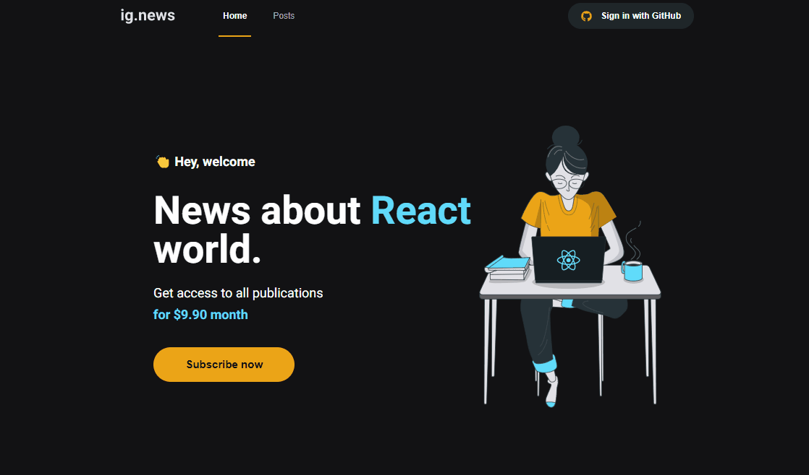

# Ignews


This is a [Next.js](https://nextjs.org/) project bootstrapped with [`create-next-app`](https://github.com/vercel/next.js/tree/canary/packages/create-next-app).

A blog, developed during the [Ignite](https://www.rocketseat.com.br/ignite) course of [Rocketseat](https://www.rocketseat.com.br/).
<br>
<br>

## 🚀 Getting Started

First, clone this repository and install all dependences.

```bash
npm install
```

Run the development server:

```bash
npm run dev
```

Open [http://localhost:3000](http://localhost:3000) with your browser to see the result.

## Features

* Autentication with Github through Next Auth


* Stripe API and Fauna DB integration for subscription


* Prismic CMS integration to built posts


## 🛠️ Built with

* Next Js
* Typescript
* SASS and Module CSS
* Fauna DB
* Prismic CMS
* Stripe API
* Next Auth


